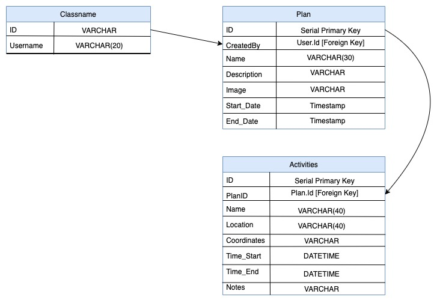

# ProPlan
## What is ProPlan?
ProPlan is a platform where you can create extensive detailed itineraries. Whether you are creating a schedule for an event, a work trip, or a vocation, ProPlan can help give you a better understanding of what you are trying to accomplish.

## Technology
Technologies that will be used to create this web application are:
- Fontend UI: ReactJS
- Backend API: PostgreSQL, ExpressJS, and NodeJS
- Integrating: Google Maps API, Google Places API, ag-Grid, and wojtekmaj

## MVP (Minimum Viable Product)
- User creation and login
- Creating a personal itenary
- Being able to edit itenary

## Additional Nice-to-Have Features
- Google Maps API for location and day view
- Link sharing

## Technical Risks

- Table editing might be too complication
  - Don't know how to create an editable cells in tables, so might take too much time to learn
- Events that take up more than 1 period of time
  - Not sure how to incorporate editing for an activity that takes up more than 1 cell.

## DB Schema

## Demo Link of Current Product
https://drive.google.com/file/d/103hApj9jaxnAPT9PZEkmU3ews2CL0frp/view?usp=sharing
